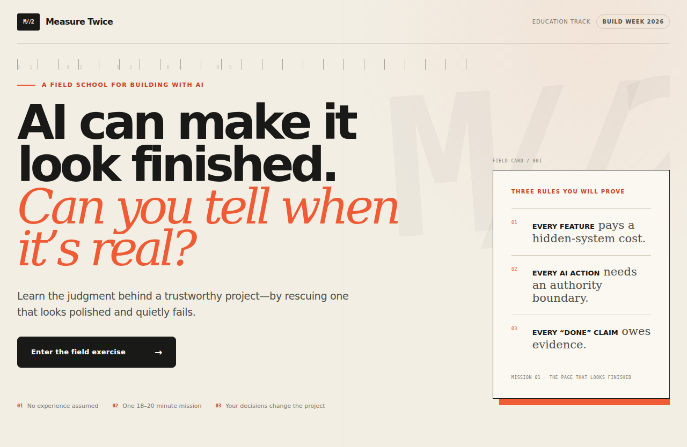

# Measure Twice

**Learn to build with AI without mistaking polish for proof.**

Measure Twice is a consequence-driven educational simulation for complete beginners. The learner rescues an AI-assisted community project that looks finished but quietly fails. They practice the judgment behind a trustworthy build: defining an outcome, preserving context, bounding AI authority, inspecting changes, demanding evidence, repairing precisely, and shipping a recoverable version.

Built for the **Education** track of OpenAI Build Week 2026.



## Why this is different

Most beginner AI courses teach prompt formulas, tool tours, or passive tips. Measure Twice teaches a durable operating method through consequences.

> AI output is a proposal. Your project becomes trustworthy through evidence.

The flagship mission uses three rules:

1. Every feature pays a hidden-system cost.
2. Every AI action needs an authority boundary.
3. Every “done” claim owes evidence.

No coding knowledge is assumed. Repository, commit, diff, environment variable, deployment, evidence, and rollback are introduced in plain language exactly when the learner needs them.

## The learning experience

The mission, **The page that looks finished**, begins with a polished Repair Café page and an AI message declaring it ready. The page contains an invented guarantee, a clipped phone action, and no proof that checks ran.

The learner moves through TRACE:

- **Target** — turn a vague request into a specific audience, outcome, proof-of-done, and non-goals.
- **Record** — create a simulated GitHub repository with trusted facts, a README, safe environment placeholders, and a known-good commit—without committing a secret.
- **Assign** — assemble a bounded context packet and distinguish local permission from consequential external action.
- **Check** — inspect the preview, diff, trusted facts, mobile behavior, accessibility, secrets, and execution log.
- **Evolve** — create a reproducible Bug Capsule, request the smallest repair, preserve passing behavior, and rerun failed checks.

The final transfer challenge removes the TRACE labels and switches from a website to a budget spreadsheet. The Build Replay then connects each decision to its consequence and evidence. It reports **mission evidence**, never false mastery after one session.


## Signature interactions

- **Context X-ray** shows which trusted facts, constraints, and permissions the AI can actually see.
- **Blast Radius** makes the hidden systems and changed files behind “helpful” extra features visible.
- **Proof Ledger** connects each requirement to an independent check; an AI claim cannot turn a requirement green.
- **Checkpoint Rewind** makes unsafe mistakes recoverable inside the simulation.
- **Build Replay** reveals the causal chain from decision to project consequence to evidence.
- **Field Manual** preserves exact templates for the build brief, repository setup, AI handoff, plan review, proof ledger, bug report, and ship gate.

See [the full curriculum](docs/CURRICULUM.md) and [product brief](docs/PRODUCT.md).

## Educational design

The core curriculum, defects, evidence, scoring, and consequences are authored and deterministic. The learner must attempt a decision before receiving feedback. Feedback always names the goal, observed evidence, transferable principle, and next repair.

GPT‑5.6 is not allowed to invent lesson truth or change the score. It receives the server-recomputed evidence profile and optional learner reflection, then returns a constrained personalized debrief. Without credentials, the same journey ends with an authored deterministic debrief.

The design draws on active learning, worked examples with fading, self-explanation, formative feedback, retrieval, authentic transfer, and evidence-centered assessment. Sources and their concrete product implications are documented in [docs/CURRICULUM.md](docs/CURRICULUM.md).

## Run locally

Requirements: Node.js 22 or newer.

```bash
npm install
cp .env.example .env.local
npm run dev
```

Open <http://localhost:3000>.

The default is fully functional deterministic judge mode. To enable the single live GPT‑5.6 debrief, keep the API key server-side and set:

```dotenv
OPENAI_API_KEY=your-server-key
OPENAI_MODEL=gpt-5.6
DEMO_MODE=false
```

Never expose `OPENAI_API_KEY` through a `NEXT_PUBLIC_` variable.

## Verify

```bash
npm run typecheck
npm test
npm run test:e2e
npm run build
```

`npm run build` creates the Cloudflare-compatible `dist` artifact used by the hosted demo. To exercise the browser suite against an already-running preview, use `PLAYWRIGHT_BASE_URL=https://your-preview.example npm run test:e2e`.

The test suite covers deterministic assessment, unsafe repository choices, scope overreach, independent evidence, repair-and-retest gates, transfer, server-side score recomputation, malformed/oversized API input, the complete desktop/mobile journey, and meaningful failure recovery.

## GPT‑5.6 implementation

- Server-side OpenAI Responses API
- Structured Outputs parsed with Zod
- `store: false`
- bounded output and low reasoning effort
- hashed `safety_identifier`
- learner text treated as untrusted data
- server-recomputed scores and evidence
- deterministic fallback for missing keys, rate limits, refusals, incomplete responses, or provider errors

The model can personalize language. It cannot alter progression, artifacts, correctness, scores, or “ready to ship.”

## How Codex was used

Codex is the primary engineering collaborator for concept exploration, official documentation research, curriculum synthesis, product architecture, implementation, tests, accessibility, interface work, and submission preparation.

Human decisions—including the Education track, beginner audience, rejection of a real project generator, content-first quality bar, TRACE learning spine, deterministic curriculum, and evidence-over-claims doctrine—are recorded in [docs/BUILD_LOG.md](docs/BUILD_LOG.md).

Before submission, the primary project thread’s `/feedback` Session ID will be added here and to Devpost.

## Judge-friendly testing

- No account, API key, payment, or external integration is required.
- Progress is stored only in local browser storage and can be reset from the header.
- The complete mission works on desktop and mobile and is keyboard accessible.
- Reduced-motion preferences are respected.
- No real repository, deployment, purchase, message, permission, or data mutation occurs.

## Supported environments

- Current desktop and mobile browsers with JavaScript and local storage enabled.
- Node.js 22+ for local development with Next.js.
- Cloudflare Workers-compatible hosting; the same four Playwright journeys run against that production runtime.
- Deterministic judge mode without an OpenAI key, or an optional server-side GPT-5.6 debrief.

## Privacy and safety

Measure Twice stores only the simulated mission state in the learner’s browser. It has no authentication, analytics, database, arbitrary code execution, GitHub OAuth, or real deployment. Model output is rendered as text and cannot perform actions.

## License

[MIT](LICENSE)
