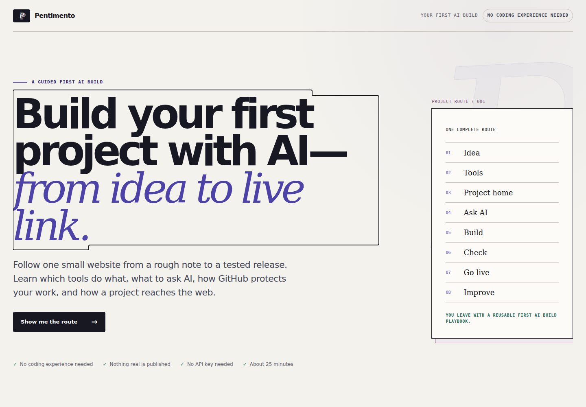

# Pentimento

> **Build your first project with AI—from idea to live link.**

Pentimento is an interactive education experience for people who want to build with AI but do not know where to start. Through one fictional Repair Café website, it teaches the complete path beneath a finished project: choosing a useful first version, understanding which tools do what, giving the work a recoverable home, asking AI for bounded changes, checking the result, publishing one exact version, and improving it safely.

It is not a coding course, project generator, prompt gallery, or ranking of AI products. It teaches a durable project lifecycle that transfers when tools and product names change.

No coding experience, account, API key, or real deployment is required. The guided journey takes about 25 minutes, and every stop adds a reusable template to the **First AI Build Playbook**.

Built for the **Education** track of OpenAI Build Week 2026.

- Live experience: [pentimento.aethe.me](https://pentimento.aethe.me)
- Source: [github.com/Lawrence-eth/measure-twice](https://github.com/Lawrence-eth/measure-twice)
- Current release evidence: [docs/HACKATHON.md](docs/HACKATHON.md)



## The problem

AI building products expose different buttons, names, and combinations of capabilities. A complete beginner can generate an impressive screen without knowing:

- which kind of tool to begin with;
- where the actual project files live;
- what Git and GitHub add;
- what to ask AI before allowing changes;
- how to tell whether a result works;
- how a private preview becomes a public link;
- when a database, login, API, payment system, or runtime AI is justified; or
- how to recover when a release is worse than the version before it.

Pentimento teaches those durable decisions rather than a temporary catalog of products.

## The route

The learner follows one small project through eight stops:

| Stop | What the learner does | What they keep |
| --- | --- | --- |
| **Idea** | Reduce an overloaded wishlist to one person, one useful result, and one complete first-version path | First-version brief |
| **Tools** | Distinguish the AI workspace, project home, and host; compare two legitimate starting lanes | Tool route card |
| **Project home** | Learn the separate jobs of a folder, Git, GitHub, commits, README files, and protected secrets | Repository starter checklist |
| **Ask AI** | Turn “make me a beautiful site” into a bounded planning request with trusted facts, exclusions, checks, and an approval point | Planning prompt |
| **Build** | Repeat ask → inspect → run → check → save through three small, visible cycles | Three named build versions |
| **Check** | Find factual, phone-layout, and contact-path defects; reproduce them and request the smallest repair | Repair report |
| **Go live** | Move one exact version through local, GitHub, preview, live, and recovery states | Release card |
| **Improve** | Make one approved post-launch update without rebuilding the project | Change plan |

The Playbook remains available from the first lesson. Completed stops mark templates as practiced; they do not lock useful guidance behind correct answers.

## One mental map for changing tools

Pentimento introduces three roles before product names:

```text
AI helps build → the project home remembers → the host publishes
```

- An **AI workspace** helps plan, creates or changes project files, and may run checks.
- A **project home** keeps the files and saved history. In the demonstrated route, that is a folder with Git and a GitHub copy.
- A **web host** turns one selected version into a preview or public link.

One product may combine several roles. The distinction still matters: a conversation is not automatically a repository, a repository is not automatically a website, and a successful deployment does not prove that a visitor can complete the important path.

The learner compares two honest starting lanes:

- **Shortest setup:** a hosted AI builder, with explicit checks for ownership, export, privacy, limits, and recovery.
- **Most transferable:** a repository-aware agent, Git/GitHub, and a separate host, with more setup but visible files and history.

Pentimento demonstrates the repository lane because it makes the lifecycle visible, not because it is universally best.

## The Repair Café case

The case begins with an ambitious rough request for a neighborhood Repair Café website. The learner keeps only the first complete public path: a nearby resident checking from a phone can understand the event, decide whether their item fits, see that repair depends on volunteer availability, and email the organizer.

Version one deliberately needs no account, booking system, database, payment, personal-data store, or AI inside the finished page. Removing those systems makes the full project route understandable while preserving real decisions about facts, scope, files, phone layout, keyboard access, versions, publication, and recovery.

Three build cycles create a readable page, complete its main visitor action, and refine the responsive presentation. The final polished preview contains realistic defects. The learner compares public wording with the approved brief, tries the contact path at 390px and by keyboard, writes a reproducible repair request, and checks the repaired V4 before the simulated release.

The final update adds one organizer-approved access fact by changing the trusted source first, preserving the working path, and saving a new recoverable version.

## Why the experience is distinctive

A *pentimento* is an earlier version visible beneath a finished work. The interface turns that idea into the learning model: the visible page is only the surface; the brief, tool choices, files, AI requests, checks, and saved versions remain inspectable underneath it.

The experience uses an editorial conservation-studio language rather than a dashboard, chatbot, or gamified course shell. Literal instruction always comes before the metaphor. Every learning screen follows the same calm rhythm:

```text
outcome → short explanation → worked example → one action →
visible consequence → reusable takeaway → optional depth
```

There are no scores, streaks, badges, mastery claims, trick questions, or “magic prompt” grades. The learner constructs, compares, inspects, repairs, and revises useful project artifacts.

## First AI Build Playbook

The Playbook contains ten copyable cards:

1. choose a starting lane;
2. define the first complete version;
3. create a recoverable project home;
4. ask AI to plan;
5. request one build cycle;
6. inspect without reading every line of code;
7. report and repair a defect;
8. protect credentials and private data;
9. publish one checked version; and
10. make a safe post-launch update.

Each card states when to use it, the exact actions, the completed Repair Café example, a reusable blank template, the expected result, and the failure it prevents. The complete Playbook also includes a plain-language glossary and a realistic seven-day route for beginning another project.

## AI can build the product without living inside it

The Repair Café page needs verified information and a normal email link. It does not need model responses, an API key, per-visitor AI cost, or another runtime failure mode.

Pentimento teaches that runtime AI belongs in a finished product only when the visitor’s useful result genuinely requires generation or interpretation that simpler rules or verified content cannot provide—and only when the team can manage keys, cost, latency, unsafe input, unreliable output, privacy, and outages.

## GPT‑5.6 Teaching Mirror

After completing the authored route, a learner may explicitly open the optional **Teaching Mirror** and submit a first-version brief for their own idea together with the tool lane they selected. The mirror returns:

- one clear strength;
- exactly two unresolved assumptions phrased as questions;
- one candidate feature to postpone, with a reason;
- one honest tradeoff in the selected tool lane; and
- exactly three small next moves.

GPT‑5.6 does not grade the learner, decide whether an idea is good, generate or execute a real project, choose progression, rank brands, access a repository, request credentials, publish anything, or take an external action.

The server validates the bounded input and structured output. The model receives only the deliberately submitted brief, lane, and a privacy-preserving safety identifier; browser progress and repository access remain outside the contract. The OpenAI key stays server-side, requests use `store: false`, and an authored fallback keeps the reflection useful when live model access is disabled or unavailable. The complete educational route never depends on the model.

## Run locally

Requirements: Node.js 22 or newer.

```bash
npm install
npm run dev
```

Open <http://localhost:3000>. No account or external service is needed for the authored route.

For an explicit deterministic judge setup:

```bash
cp .env.example .env.local
```

Keep:

```dotenv
DEMO_MODE=true
OPENAI_MODEL=gpt-5.6
```

To exercise the live Teaching Mirror, keep the credential on the server and set:

```dotenv
OPENAI_API_KEY=your-server-key
OPENAI_MODEL=gpt-5.6
DEMO_MODE=false
SAFETY_SALT=replace-with-a-random-server-secret
```

Never expose `OPENAI_API_KEY` through a `NEXT_PUBLIC_` variable, browser code, a prompt, a screenshot, or a commit.

## Verify

```bash
npm run typecheck
npm test
npm run test:e2e
npm run build:next
npm run build
```

- `npm test` covers the authored state, persistence validation, and Teaching Mirror API boundary.
- `npm run test:e2e` exercises the complete desktop/mobile learning route, exact restoration, keyboard behavior, accessibility scans, and responsive layouts.
- `npm run build:next` verifies the conventional Next.js production build.
- `npm run build` creates the Cloudflare Workers-compatible `dist` artifact and copies the Sites hosting metadata.

After `npm run build`, exercise the generated Worker locally:

```bash
npm run start
```

Run the browser suite against an already-hosted candidate with:

```bash
PLAYWRIGHT_BASE_URL=https://pentimento.aethe.me npm run test:e2e
```

Recapture the judge-facing desktop and mobile gallery from an exact hosted
candidate with:

```bash
SCREENSHOT_BASE_URL=https://pentimento.aethe.me node scripts/capture-release-screenshots.mjs
```

Passing a local development journey does not prove the generated Worker or deployed custom domain. Final evidence belongs to the exact release artifact and is recorded in [docs/HACKATHON.md](docs/HACKATHON.md).

## How Codex and GPT‑5.6 were used

Codex was the primary build collaborator. It helped turn the initial Education-track idea into a bounded curriculum; research the durable roles behind current AI building products; author the Repair Café case, templates, defects, and release route; model the versioned progress and structured Teaching Mirror boundary; implement the responsive interaction system; review accessibility and beginner comprehension; write tests; and prepare the Cloudflare-compatible artifact and submission material.

The human retained the consequential product decisions: teach building rather than coding, serve complete beginners, follow one project from nothing to release, teach roles rather than rank brands, keep practical content available from the beginning, use the Pentimento identity, and treat content and interaction quality as the primary standard.

GPT‑5.6 contributes through the optional Teaching Mirror described above. Its role is intentionally smaller than the authored curriculum: it reflects one learner-supplied brief into questions and next moves, while deterministic product logic controls the lesson.

The dated collaboration record is in [docs/BUILD_LOG.md](docs/BUILD_LOG.md). The primary project thread’s `/feedback` Session ID must be added to the Devpost form before submission.

## Judge testing notes

- Start at the live URL or run the repository locally; no login or API key is required.
- Choose **Show me the route**. The opening explains the outcome, time, safety boundary, eight stops, and Playbook before asking for a project decision.
- Use the layer reveal, then progress through the Repair Café route one focused action at a time.
- Open **My Playbook** at any point to inspect or copy all ten practical templates.
- In Check, run the three simulated lenses, assemble the bounded repair request, and inspect how the named versions differ.
- In Go live, record Local, GitHub, Preview, Live, and Recovery separately. Every URL and external action inside the lesson is simulated.
- At completion, optionally try the Teaching Mirror with a brief for your own idea. It returns reflection only and does not build or grade anything.
- Progress is stored in this browser. Restart is confirmed before the v3 record is removed.

## Privacy and safety

Pentimento has no authentication, analytics, database, GitHub OAuth, arbitrary code execution, real deployment action, payment, or Repair Café visitor-data collection.

Authored route progress and constructed choices remain in local browser storage. Nothing leaves the browser unless the learner explicitly invokes the Teaching Mirror. That request contains only the submitted first-version brief, selected lane, and a random session identifier; it does not contain the learner’s route history or grant repository access. In live mode, the validated brief, lane, and derived privacy-preserving safety identifier are sent to OpenAI, and the structured result is rendered as untrusted text.

The Repair Café, organizer, addresses, commits, preview URLs, public URLs, versions, and release actions inside the lesson are fictional or simulated. No real email is sent and nothing is published.

## Documentation

- [Product brief](docs/PRODUCT.md)
- [Curriculum and content standard](docs/CURRICULUM.md)
- [Quality standard](docs/QUALITY_STANDARD.md)
- [Build and Codex collaboration log](docs/BUILD_LOG.md)
- [Hackathon closeout](docs/HACKATHON.md)

## License

[MIT](LICENSE)
