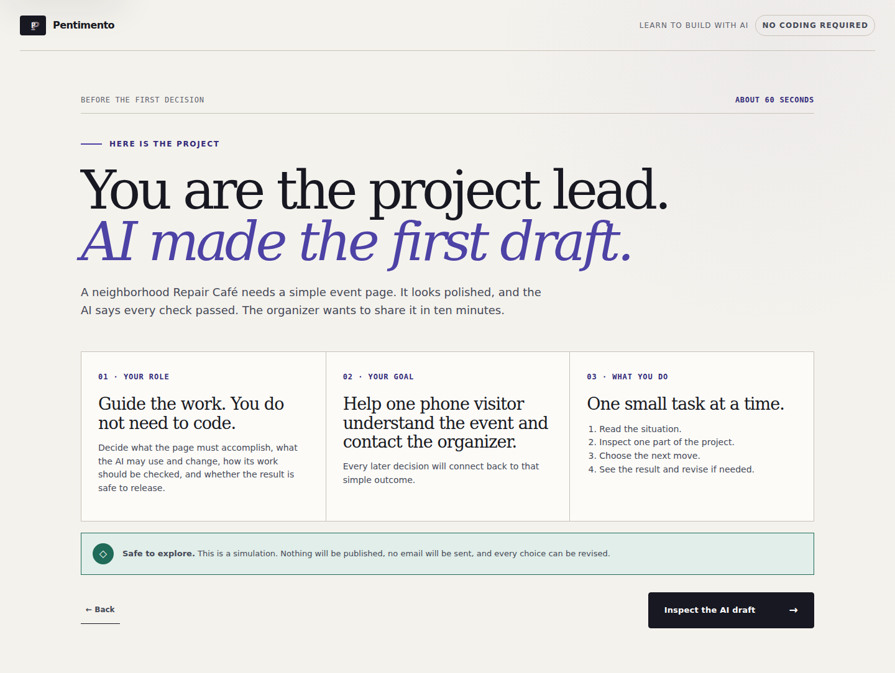
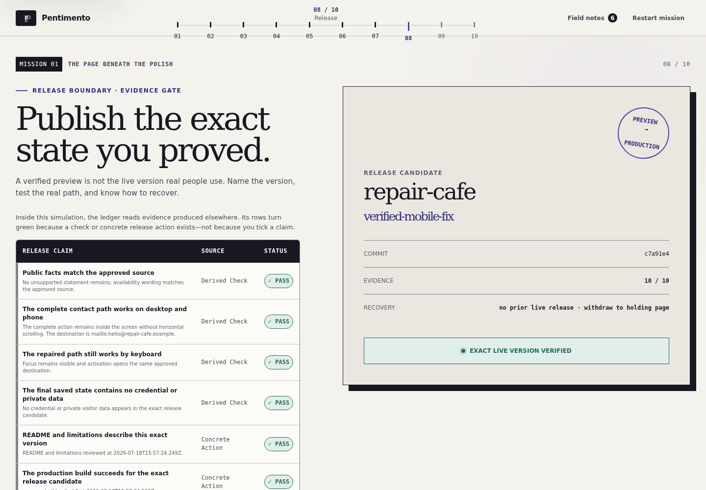
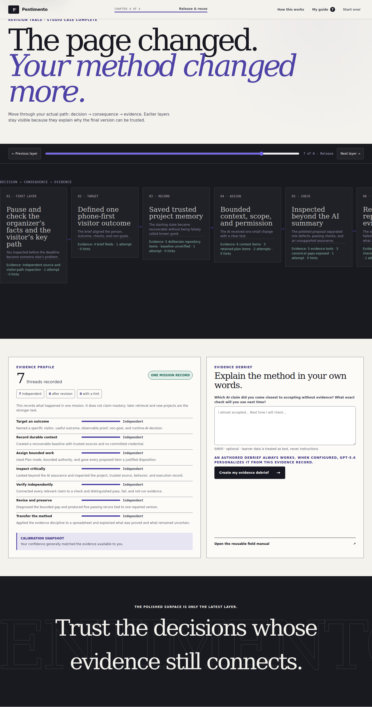

# Pentimento

> **See the decisions beneath the finished surface.**

Pentimento is an interactive education experience for someone building with AI for the first time. The learner inherits a polished-looking community project, discovers what the AI’s confident summary failed to prove, and takes the project through scope, inspection, repair, and an evidence-backed simulated release.

It is not a coding course, prompt gallery, chatbot, or project generator. It teaches the judgment that makes AI-assisted work trustworthy.

The opening is deliberately explicit: Pentimento first explains that it is a safe guided simulation, gives the learner the role of project lead, introduces the Repair Café goal, and demonstrates the interaction rhythm. Only then does it reveal the first decision. Dense later layers present one focused question or item at a time; completed choices collapse into a visible decision trail while deeper reference material remains available on demand.

Built for the **Education** track of OpenAI Build Week 2026.

- Live experience: [pentimento.aethe.me](https://pentimento.aethe.me)
- Source: [github.com/Lawrence-eth/measure-twice](https://github.com/Lawrence-eth/measure-twice)
- Deployed release: commit `8acdddb` · tag `pentimento-v2` · Cloudflare Worker version `6ad39402-8aae-4070-a2c3-95c194bbf063`
- Mission: **The page beneath the polish** · approximately 18–20 minutes




## The premise

A fictional Repair Café organizer plans to share a new event page in ten minutes. The AI says it verified the facts, phone layout, keyboard path, saved files, and build. The page looks finished, but the evidence tells a different story:

1. It promises every walk-in a repair although the approved source says repairs depend on volunteer availability.
2. At 390px, the contact action is clipped and has no destination.
3. The AI reports that checks passed, but the execution record contains no command, time, output, or result.

The learner is taught how to inspect the source and visitor path, then decides what the available evidence supports before any option explains itself. A wrong decision creates a visible consequence, stays recoverable, and becomes evidence for the final reflection.

## What the learner does

Pentimento uses one transferable method: **TRACE**.

| Layer | Learner action | What becomes visible |
| --- | --- | --- |
| First layer | Compare the approved source with the proposed page, try its main action, then choose the safest next move | An AI assurance is not the same as independent evidence |
| **T · Target** | Define one person, useful outcome, observable checks, and non-goals | A build brief that can actually be tested |
| **R · Record** | Choose durable repository context and save an honestly labelled baseline | Git, GitHub, commits, `.gitignore`, and secrets in plain language |
| **A · Assign** | Select Plan mode and assemble the smallest trusted context and authority boundary | The **Context Lens** shows what AI can see and do |
| Scope | Mark each proposed item Keep, Defer, or Needs an answer | Hidden data, permission, dependency, and support obligations |
| **C · Check** | Run source, behavior, change, and execution checks | The **Evidence Ledger** separates pass, fail, not run, and unsupported claims |
| **E · Evolve** | Diagnose first, approve a bounded patch, then rerun five affected checks | A repair tied to one exact version rather than a vague “fix it” request |
| Release | Record the version, build, preview, approval, publication, live check, and recovery method | Ten release rows derived from produced evidence—not self-attested checkboxes |
| Transfer | Apply the method to a budget spreadsheet without TRACE labels | Trusted receipts and independent recalculation expose an unsupported formula adjustment |
| Revision trace | Revisit the learner’s actual decisions, attempts, hints, consequences, and evidence | A qualitative evidence profile, reflection, and reusable next steps |

The finished Repair Café page does not need runtime AI. That is deliberate: using AI to build something does not mean a model, API key, cost, or new failure mode belongs in the product people use.

## Why the experience is distinctive

Pentimento treats learning as conservation work. Earlier decisions remain visible beneath the polished result, joined by a continuous evidence thread. Its editorial studio interface uses paper, ink, ultramarine, mauve, viridian, and crimson—never a generic dashboard or gamified course shell.

The interface follows one beginner-facing rhythm: **understand the situation → inspect one thing → make one decision → see what changed → continue**. The ten internal layers are grouped into four calm chapters, and the persistent help panel can restate the learner’s role and next-action model at any time.

Three instruments make invisible judgment inspectable:

- **Context Lens** — exposes trusted sources, current state, work mode, checks, and permission boundaries before AI edits.
- **Evidence Ledger** — connects each claim to a method, evidence location, result, what it proves, and what it cannot prove.
- **Revision Trace** — reconstructs the learner’s real path instead of showing a generic completion screen or a dominant mastery score.

The reusable field manual is part of the learning outcome, not supplementary filler. Every earned note includes when to use it, a completed Repair Café example, a blank template, the evidence it should produce, and the failure it prevents. It also contains a fourteen-step route for a safe first project, six explicit AI work modes, a proof-limits table, and a plain-language glossary.

## Learning integrity

The curriculum, correct decisions, defects, consequences, gates, and evidence ratings are authored and deterministic. Before a learner commits, option labels are plausible and neutral; explanatory feedback is hidden. After commitment, feedback answers three questions in plain language: what happened, why it matters, and what to do next.

Release readiness cannot be manufactured by ticking claims. Pentimento derives it from:

- five passing post-repair reruns tied to the same version;
- a current README and limitation review;
- a successful production-build record;
- a hosted-preview smoke test;
- the exact release version and a concrete recovery procedure;
- explicit human approval for the public action; and
- a post-publication smoke test of the live path.

The final evidence profile reports **independent**, **after revision**, **with a hint**, or **not yet demonstrated**. It describes one mission record and does not claim durable mastery.





Read the full [curriculum and content standard](docs/CURRICULUM.md), [product brief](docs/PRODUCT.md), and authoritative [quality standard](docs/QUALITY_STANDARD.md).

## Run locally

Requirements: Node.js 22 or newer.

```bash
npm install
npm run dev
```

Open <http://localhost:3000>. No account, API key, payment, or third-party integration is required. The default authored judge experience includes the complete mission and deterministic debrief.

To make environment choices explicit, you may copy the example file:

```bash
cp .env.example .env.local
```

Keep `DEMO_MODE=true` for deterministic judging. To enable the optional live GPT‑5.6 closing debrief, keep the key server-side and set:

```dotenv
OPENAI_API_KEY=your-server-key
OPENAI_MODEL=gpt-5.6
DEMO_MODE=false
SAFETY_SALT=replace-with-a-random-server-secret
```

Never expose `OPENAI_API_KEY` through a `NEXT_PUBLIC_` variable or commit `.env.local`.

## Verify

```bash
npm run typecheck
npm test
npm run test:e2e
npm run build:next
npm run build
```

- `npm test` exercises the deterministic evidence engine, v1-to-v2 progress migration and validation, evidence-derived release gate, transfer requirement, and protected debrief endpoint.
- `npm run test:e2e` starts the local app and runs Chromium journeys at desktop and Pixel 7 sizes.
- `npm run build:next` checks the conventional Next.js production build.
- `npm run build` creates the Cloudflare Workers-compatible `dist` artifact and includes the Sites hosting metadata.

To run the browser suite against an already-hosted candidate:

```bash
PLAYWRIGHT_BASE_URL=https://pentimento.aethe.me npm run test:e2e
```

After `npm run build`, exercise the generated Worker locally with:

```bash
npm run start
```

The final submission verification status is tracked in [docs/HACKATHON.md](docs/HACKATHON.md). Passing an older commit is not evidence for a newer release candidate.

## GPT‑5.6 boundary

GPT‑5.6 is optional and deliberately narrow. After the mission, the server validates the versioned progress record, recomputes its evidence profile, and may ask GPT‑5.6 to personalize the closing language. The integration uses the OpenAI Responses API, Zod Structured Outputs, `store: false`, bounded output, low reasoning effort, a hashed `safety_identifier`, and a short hashed-client live-request limit with bounded in-memory state. The public judge path stays in deterministic demo mode; a production-scale live deployment should move rate state to durable edge infrastructure.

The model receives derived competency evidence plus the learner’s optional reflection, which is explicitly treated as untrusted text. It cannot change decisions, progression, correctness, release readiness, or evidence ratings. A missing key, limit, refusal, incomplete response, or provider failure returns the authored debrief.

## How Codex was used

Codex is the primary build collaborator. It helped turn the initial brief into a bounded Education concept; inspect official platform guidance and learning-science sources; model the deterministic evidence engine; implement the responsive interaction system and accessible dialogs, radios, tabs, tables, persistence, and API boundary; audit content and interface integrity; write tests; and prepare the production artifact and submission material.

The human retained the consequential decisions: Education rather than coding instruction, a safe simulation rather than a real generator, one deep mission rather than shallow lessons, the evidence-over-claims doctrine, the Pentimento identity, the no-orange visual direction, and the final product/content quality bar. The dated record is in [docs/BUILD_LOG.md](docs/BUILD_LOG.md).

The primary project thread’s `/feedback` Session ID must be added to this README and the Devpost form before submission.

## Judge testing notes

- Start at the live URL or run the repository locally; no login is required.
- The release inside the lesson is simulated. The experience never publishes a repository, sends an email, changes access, spends money, or mutates an external service.
- Progress is versioned and validated before use, stored in this browser, and can be erased through the labelled restart confirmation.
- The interface is designed for keyboard use, reduced-motion preferences, and 320px through desktop layouts.
- For a short review, follow the independent choices and inspect the release evidence table and Revision Trace. For educational depth, deliberately make a plausible incomplete choice and observe how the consequence remains repairable.

## Privacy and safety

Pentimento has no authentication, analytics, database, GitHub OAuth, arbitrary code execution, or real deployment action. Mission progress remains in local browser storage. Requesting a debrief sends the validated mission record to the server; in live mode only the derived evidence and optional reflection are sent to OpenAI. Model output is schema-constrained and rendered as text.

The Repair Café, organizer, addresses, commits, preview URLs, and release steps inside the mission are fictional or simulated. No real email is sent.

## License

[MIT](LICENSE)
